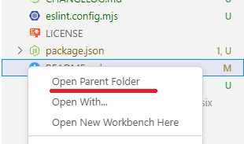

# Open Parent Folder - VS Code Extension

**Open Parent Folder** is a simple Visual Studio Code extension that allows you to quickly navigate to the parent directory of the currently selected folder or file in the Explorer view. Instead of manually navigating through the file system or using the terminal, users can simply right-click in the Explorer and choose the **"Open Parent Folder"** option.

## Features

- Adds a right-click context menu item in the Explorer to quickly navigate to the parent folder.
- Supports navigating to the parent directory without needing to use the command line or `Open Folder` dialog.

## Installation

1. Open your VS Code editor.
2. Go to the Extensions view by clicking on the Extensions icon in the Activity Bar on the side of the window.
3. Search for **"Open Parent Folder"** and click the Install button.

## Usage

After installation, right-click on any folder or file in the Explorer view and select **"Open Parent Folder"** from the context menu to navigate up to the parent directory.

## Change Log

### [0.0.1] - 2025-01-10

- **Initial Release**: Added the functionality to quickly navigate to the parent folder from the VS Code Explorer with a right-click option.
- Created the context menu item: **"Open Parent Folder"** for easy navigation.
- Supports moving to the parent directory without using the command line or the `Open Folder` dialog.

## License

MIT License. See the LICENSE file for more details.
